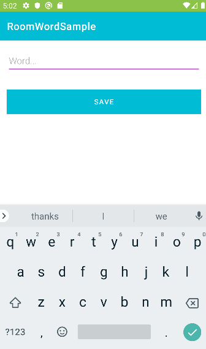
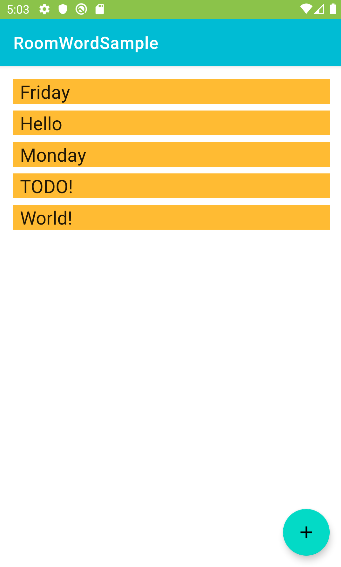

<h1 align="center">RoomWordSample 📝 </a> 
<h3 align="center">This simple application just adds words to the database. It is designed using the architecture components Room, ViewModel, and LiveData.</h3>
<h3 align="center"> The interface is very simple, you will need to do is click the button ➕</h3>
<h3 align="center">After pressing the button you can add a new words to the list</a>  
<h1 align="center"></a>
<h4 align="center"> This app "RoomWordSample" with a minimum SDK level of 24 ✔️</h1>
<h1 align="center"></a>
<h4 align="center"> Screenshots of the Application below ⬇️ </h4>
<h4 align="center">  </h4>
